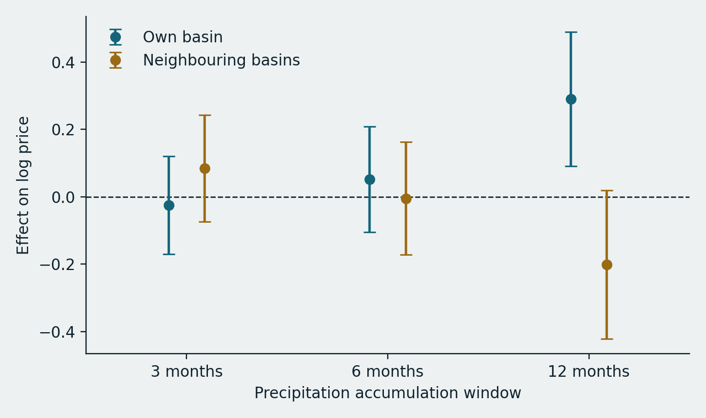
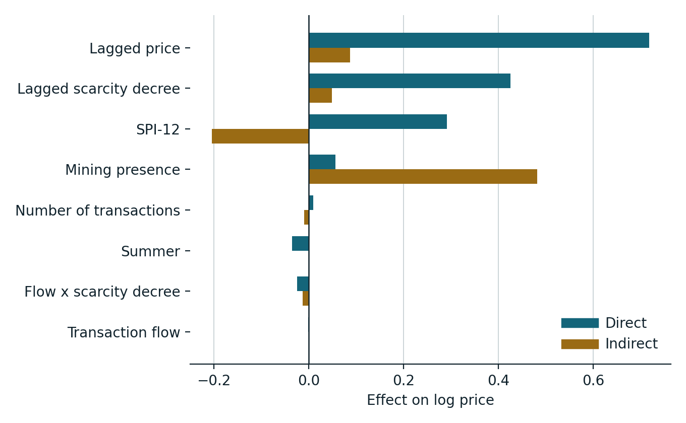
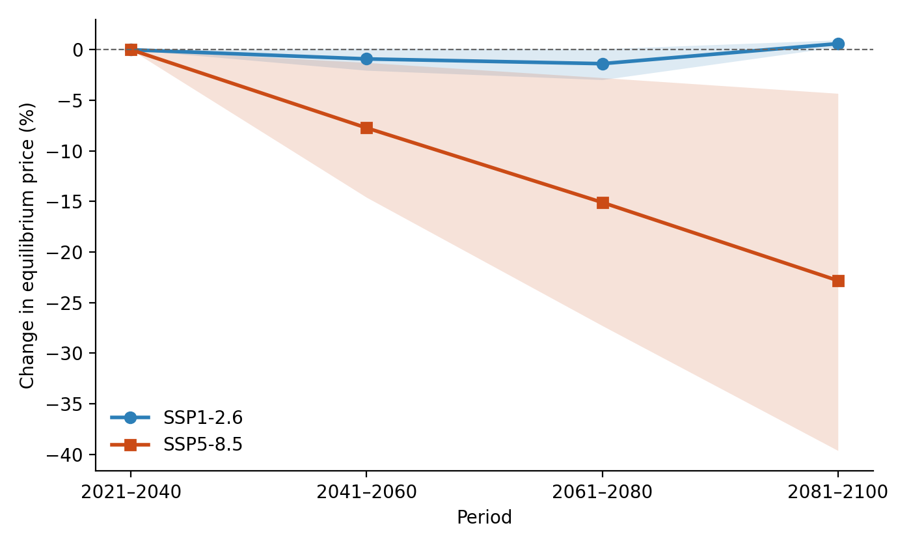

<!-- _class: title -->

  Co-author meeting &middot; August 2026

# Does the Chilean water market price scarcity?

Revised analysis and manuscript

Wolff &middot; Roco &middot; Samaniego &middot; Ometto 
Formerly: <em>Climate change and water rights transactions in Mediterranean Chile</em>

---

## Where we were

**Submitted question.** How will climate change affect water rights prices?

**Submitted answer.** Drought raises prices, creating a "perfect storm" that intensifies aquifer exploitation, with prices projected to 2100 under two SSPs.

**Outcome.** Rejected at *International Journal of Water Resources Development*.

 

The reframing below is not a response to that rejection. It follows from an audit of the estimation pipeline that we ran before resubmitting.

---

## What the audit found

Four defects in the code that produced the submitted results. Each is checkable from the notebook and the data files.

|                            |                                                                                                                                                                           |
|----------------------------|---------------------------------------------------------------------------------------------------------------------------------------------------------------------------|
| **Weight matrix**          | Built from the stacked panel, so all 8,160 neighbour links connected a basin to *itself* in another month. None crossed a basin boundary.                                 |
| **Drought index**          | The SPI routine was applied to the `year` column, not to precipitation. Dry months were dropped, then zero-filled.                                                        |
| **Specification**          | Estimated as a spatial autoregression, reported as a Durbin model.                                                                                                        |
| **Effects and projection** | Impacts sliced the multiplier diagonal instead of using LeSage–Pace. The projection omitted the spatial multiplier and fed annual precipitation to a monthly coefficient. |

---

## A simple check

In the submitted Table 3, the indirect/direct ratio was **0.100 for every single variable**.

That is not a result. It is <code>&rho;/(1&minus;&rho;)</code> with &rho; = 0.0922, which is what a spatial autoregression produces algebraically when the Durbin terms are absent.

> A varying ratio is the signature of a Durbin process. A constant one is the signature of its absence.

This is the single fastest way for a referee to detect the problem, which is part of why fixing it matters more than the rejection did.

---

<!-- _class: divider -->

# The question changed

  From forecasting prices under climate change to testing whether the market prices scarcity at all

---

## Where we are

**New question.** The 1981 Water Code assumed tradable rights would price scarcity and discipline use. Do they?

**Why this is the better question.** It makes our null and negative results into findings rather than disappointments, and it puts the paper inside the debate that produced the 2022 reform.

**What we can now claim.** A defensible spatial Durbin model, selected by test rather than asserted, with a climate effect that survives specification testing.

Sample: 8,020 transactions, 15 basins, monthly, 2005–2014. SPI from a 42-year catchment record, 1979–2020.

---

## Result 1 — the market responds at one timescale only

Own-basin and neighbouring-basin drought coefficients with 95% intervals, by accumulation window. Nothing at three or six months. Both effects appear at twelve.

---

## Result 2 — the sign runs the wrong way, and reverses across basins

**Own basin +0.291** &nbsp;&middot;&nbsp; *Neighbouring basins &minus;0.204* &nbsp;&middot;&nbsp; Total +0.087

A wetter year raises the price of a right where it falls and lowers it next door.

Read in reverse: **drought devalues the entitlement locally**. Where a right is nominal and its exercise depends on physical availability, scarcity reduces the water attached to it rather than bidding up its price.

The negative neighbour term reads as substitution. When water is available nearby, buyers hold alternatives.

> Because the two channels nearly cancel, regionally synchronous drying — which is what climate projections describe — produces a far weaker response than a localised drought.

---

## Result 3 — institutions beat hydrology

A scarcity decree in the previous month raises prices by about half (0.426, z = 4.74). Mining presence acts almost entirely through neighbouring basins.

---

## Result 4 — projections, rebuilt

SSP1-2.6 flat. SSP5-8.5 falls ~23% by 2100, 90% interval &minus;39.6 to &minus;4.3, direction robust in 97% of draws. Delta-change bias correction applied: both scenarios sit 32% below observed climatology already in 2030 and agree there, which is model bias rather than signal.

---

## What survived and what did not

| Survived | Did not |
|---|---|
| Price persistence (weakened, and now bounded) | The spatial spillover in prices |
| Market activity effects | The SPI result as previously reported |
| The whole Discussion — Valdés-Pineda, Womble, Loch, McNamara, e-flows, NBS | The "perfect storm" framing |
| Figure 1 and the Introduction | Tables 2, 3 and 4 |

**62% of the substantive paragraphs of the submitted version appear in the revision essentially verbatim.**

---

<!-- _class: divider -->

# The missing figure

Horacio's point: the paper carries three tables and only two figures

---

## Two candidates, both already drafted

**A — Drought coefficient by accumulation window** (slide 7)
The timescale result currently exists only as a sentence of prose. This makes it visible and pre-empts the referee question "why twelve months?".

**B — Effects decomposition** (slide 9)
The own/neighbour sign reversal is our contribution and it is currently buried in Table 3. Showing it also demonstrates visually why the Durbin specification was necessary.

 

**Proposal.** Take both. Promote B to Figure 2 and the projection to Figure 4, and Table 3 becomes an appendix. Consistent with reporting results as figures rather than tables.

---

## Open decisions

1. **The abstract's closing line** asserts a policy failure on the strength of a price response. Keep or cut?
2. **The scarcity-decree result** admits an informational and a regulatory reading. Our data cannot separate them. Do we say more than that?
3. **Basin 43** was dropped for want of a precipitation record but exists in the shorter file. Recoverable?
4. **Title.** Currently a question. Some venues dislike that.
5. **Repository timing.** Public now, so referees can verify, or at acceptance?

---

## Venue

**Water Resources and Economics** — Elsevier, hybrid so no charge on the subscription route, IF 3.3, Q2 in Economics and Econometrics. Water markets, valuation and spatial econometrics are core scope.

*Water Economics and Policy* — World Scientific, SSCI and SCIE, subscription. Lower visibility, very close scope fit.

Avoid: Water Resources Research is now fully open access, MDPI Water is gold OA. Both carry charges.

**Why not Water International.** Same publisher family as the journal that rejected us. Legitimate, but similar tier, and only worth it after the corrections are in.

---

## What is done and what remains

**Done.** Corrected pipeline. Revised manuscript, 24 pages. New abstract. Reference-list repairs. Public reproduction repository with a project site.

- [GitHub repository](https://github.com/horaciosamaniego/chile-water-rights-scarcity/tree/main) (also, [project site](https://horaciosamaniego.github.io/chile-water-rights-scarcity/))
  
**Remains**

- Confirm SISS terms permit redistributing the transaction aggregate
- Citation for Law 21,435 beyond the statute
- Decide the figure set and renumber
- Read the revision and mark disagreements
- Cover letter noting the correction explicitly

---

<!-- _class: title -->

Discussion

# The paper is stronger and says the opposite

A market that devalues entitlements as water grows scarcer transmits no incentive to conserve it.  That is the finding. The question is how hard we push it.
